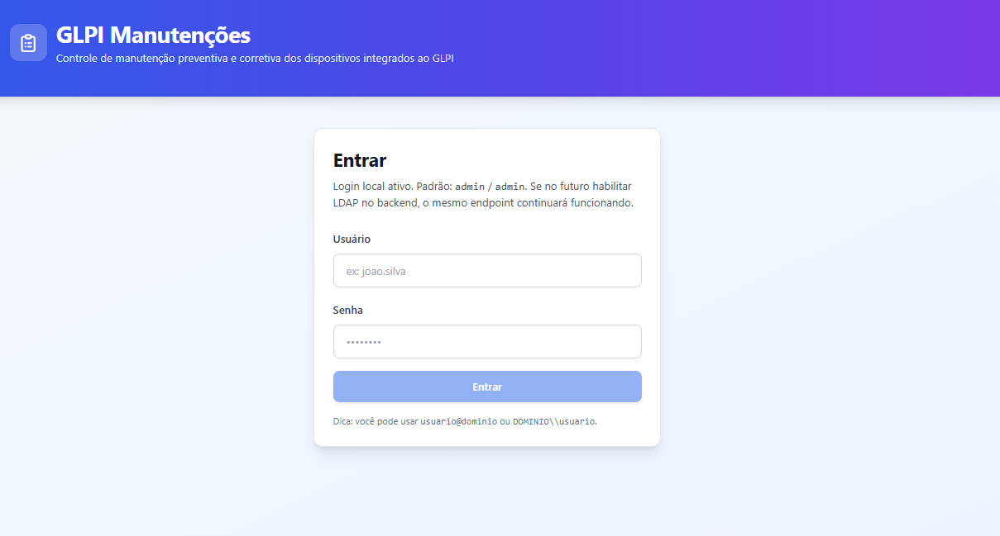
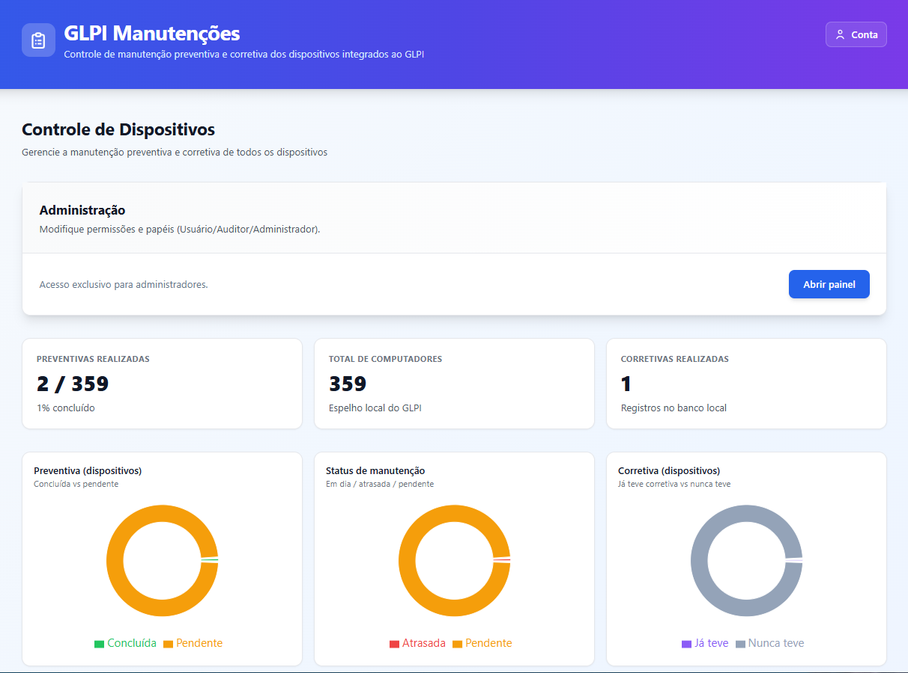
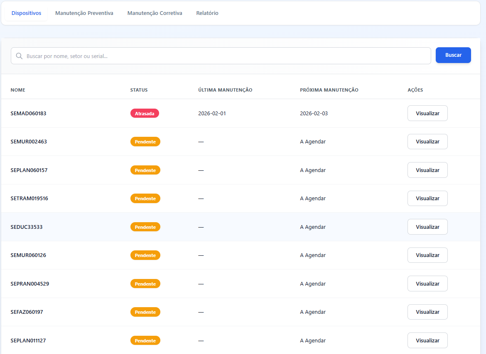
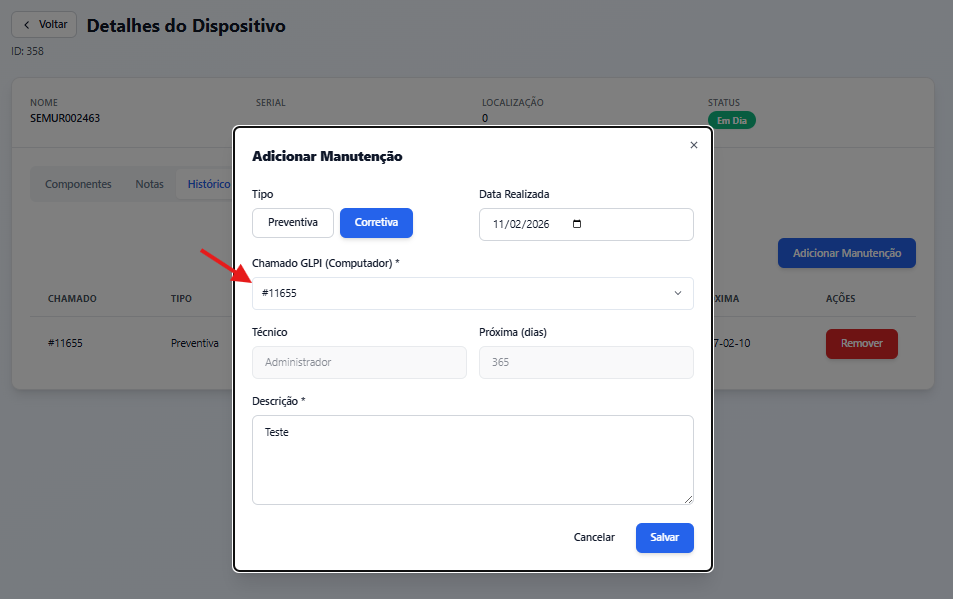
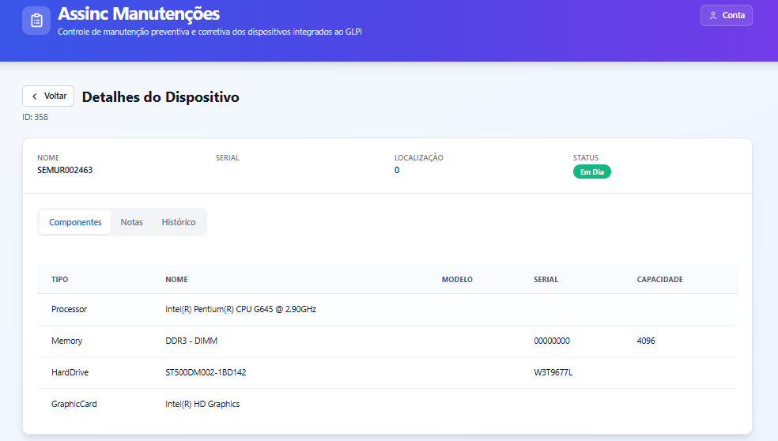
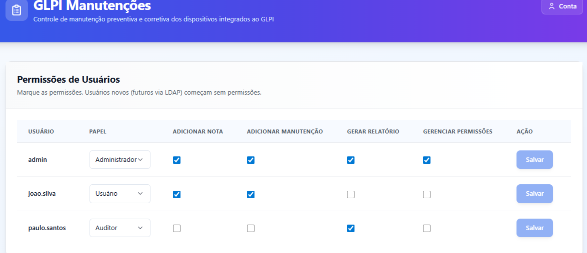
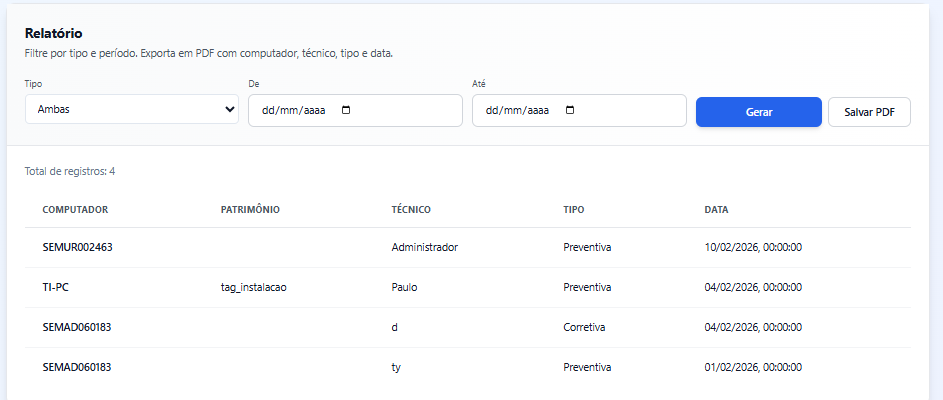
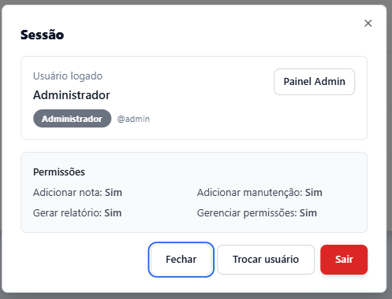

# Assinc Manutenções

Projeto full-stack criado para apoiar a empresa onde atuo: identifiquei uma necessidade real de **organizar o controle de manutenção de computadores** (preventiva/corretiva) e **gerar relatórios** de forma prática, usando o GLPI como fonte de verdade dos ativos.

O objetivo é reduzir retrabalho e dar visibilidade: o GLPI continua sendo o inventário, e este sistema cuida do **processo de manutenção**, histórico e relatórios.

## O que este projeto resolve

- Mantém um **espelho local (MySQL)** dos computadores do GLPI via sincronização.
- Integração com o GLPI é **leitura para inventário** e **escrita pontual** apenas para adicionar comentário (follow-up) no chamado vinculado à manutenção.
- Permite registrar **manutenções**, adicionar **notas** e consultar histórico por dispositivo.
- Ao registrar uma manutenção, é **obrigatório vincular um chamado do GLPI** (categoria **Computador**) e o sistema registra esse vínculo no histórico.
- Após salvar a manutenção, o sistema **envia uma mensagem no chamado do GLPI** informando que a manutenção foi realizada (best-effort).
- Traz **dashboard/indicadores** e **relatórios** para apoiar a gestão.
- Possui **login com JWT** e **permissões** por usuário (RBAC + granular).

## Arquitetura (visão rápida)

- **Frontend**: Next.js (App Router) + TypeScript + Tailwind.
- **Backend**: FastAPI + SQLAlchemy.
- **Banco**: MySQL.
- **Integração GLPI**: API REST do GLPI para leitura de inventário + comentários em chamados vinculados.

Fluxo de dados:

1) Sync lê dados do GLPI → 2) persiste em MySQL → 3) app consulta o espelho local → 4) notas são gravadas no MySQL; manutenções são gravadas no MySQL e geram um **follow-up no ticket do GLPI** vinculado.

## Vinculação obrigatória de chamado (GLPI)

Quando você abre o modal de manutenção no dispositivo:

1) O Frontend busca uma API do backend que consulta o GLPI e lista **somente chamados abertos** da categoria **Computador**.
2) Você seleciona o **ID do chamado**.
3) Ao salvar a manutenção, o sistema grava `glpi_ticket_id` no histórico.
4) Em seguida, o backend envia uma mensagem no ticket do GLPI avisando que a manutenção foi realizada no computador (best-effort).

## Screenshots

















## Autenticação

- Login padrão é **local** (tabela de usuários no banco) e emite JWT.
- Existe suporte opcional para LDAP/AD (controlado por variável de ambiente), mas o login local continua disponível.

Usuário inicial (seed): **admin/admin**.

## Modelagem e integridade do sync

- A chave estável do dispositivo é o `glpi_id`.
- O banco tem `glpi_id` como **UNIQUE** para impedir duplicidade.
- O sync é idempotente: se o nome do PC mudar no GLPI, o registro é **atualizado**, não duplicado.

## Como rodar (Windows)

### Pré-requisitos

- Node.js (LTS)
- Python 3.11+ (ou compatível com as dependências)
- MySQL (XAMPP ou MySQL Server)

### 1) Banco de dados

Crie o banco e usuário local (exemplo):

- Script: [python-api/init_local_mysql.sql](python-api/init_local_mysql.sql)

> As tabelas são criadas automaticamente pelo SQLAlchemy ao iniciar a API.

### 2) Backend (FastAPI)

1) Configure variáveis de ambiente:

- Copie [python-api/.env.example](python-api/.env.example) para `python-api/.env`
- Preencha `DB_*`, `GLPI_APP_TOKEN`, `GLPI_USER_TOKEN` e troque `JWT_SECRET`

2) Instale dependências:

```bash
cd python-api
pip install -r requirements.txt
```

3) (Opcional) Rode o sync manual 1x:

```bash
python tools\run_sync.py
```

4) Suba a API:

```bash
python -m uvicorn --app-dir . main:app --host 127.0.0.1 --port 8002 --reload
```

Health check:

- `http://127.0.0.1:8002/api/health`

Mais detalhes: [python-api/README.md](python-api/README.md)

### 3) Frontend (Next.js)

1) Configure o endpoint do backend:

- Ajuste [Frontend/.env.local](Frontend/.env.local)

Exemplo:

```env
NEXT_PUBLIC_PY_API_URL=http://127.0.0.1:8002
```

2) Instale e rode:

```bash
cd Frontend
npm install
npm run dev
```

Mais detalhes: [Frontend/README.md](Frontend/README.md)

## Dicas de operação

- Se a API do GLPI bloquear seu IP (`ERROR_NOT_ALLOWED_IP`), você precisa liberar o IP do servidor que roda o backend no cliente da API do GLPI.
- Para rodar sync automático 1x por dia, existe um script em [python-api/tools/daily_sync.sh](python-api/tools/daily_sync.sh).

## Para recrutadores

Este repositório demonstra:

- Integração com sistema legado (GLPI) de forma segura (read-only + espelho local)
- Backend com FastAPI + SQLAlchemy, endpoints e validações
- Frontend moderno com Next.js, rotas protegidas e UX orientada a permissões
- Preocupação com confiabilidade (sync idempotente + constraints no banco)

## Licença

Defina a licença conforme sua necessidade (ex.: MIT) antes de publicar externamente.
